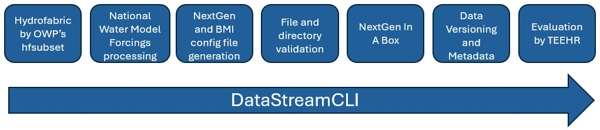

# DataStreamCLI
DataStreamCLI is a stand alone tool that automates the complete workflow from preprocessing input data for [NextGen](https://github.com/NOAA-OWP/ngen) to execution of the NextGen simulation through [NextGen In a Box](https://github.com/CIROH-UA/NGIAB-CloudInfra) (NGIAB). 

DataStreamCLI serves as the workflow tooling for the [NextGen Research DataStream](https://github.com/CIROH-UA/ngen-datastream). This software allows users to run NextGen in an efficient, _relatively_ painless, and reproducible fashion while providing flexibility and integrations like hfsubset, NextGen In A Box, and TEEHR.



## Getting Started
* **Installation:** Follow the [Installation Guide](https://github.com/CIROH-UA/datastreamcli/blob/main/INSTALL.md) to prepare your environment for `DataStreamCLI`.
* **Guide:** Start by running the [DataStreamCLI guide](https://github.com/CIROH-UA/datastreamcli/blob/main/scripts/datastream_guide)! It is an interactive script that will provide a tour of the repo as well as help you form a command with `DataStreamCLI`.
* **Status:** Check the [status page](https://github.com/CIROH-UA/datastreamcli/blob/main/STATUS.md) for availability of tooling/integrations.
* **Docs**: Make sure to review the [documentation](https://github.com/CIROH-UA/datastreamcli/blob/main/docs/) for
  * Available [NextGen models](https://github.com/CIROH-UA/datastreamcli/blob/main/docs/NGEN_MODELS.md) and automated BMI configuration generation
  * [Datastream options](https://github.com/CIROH-UA/datastreamcli/blob/main/docs/DATASTREAM_OPTIONS.md)
  * Input and output [directory structure](https://github.com/CIROH-UA/datastreamcli/blob/main/docs/STANDARD_DIRECTORIES.md)
  * A [usage guide](https://github.com/CIROH-UA/datastreamcli/blob/main/docs/USAGE.md) for executing `DataStreamCLI` effectively 
  * A step-by-step [breakdown](https://github.com/CIROH-UA/datastreamcli/blob/main/docs/BREAKDOWN.md) of `DataStreamCLI`'s internal workflow
  * An explanation of the [Research DataStream](https://github.com/CIROH-UA/datastreamcli/blob/main/research_datastream/README.md)

## Run DataStreamCLI
This example will execute a 24 hour NextGen simulation over the Palisade, Colorado watershed with CFE, SLOTH, PET, NOM, and t-route configuration distributed over 4 processes. The forcings used are the National Water Model v3 Retrospective.

First, obtain a hydrofabric file for the gage you wish to model. There are several tooling options to use to obtain a geopackage. One of which, [hfsubset](https://github.com/lynker-spatial/hfsubsetCLI), is maintained by Lynker and is integrated in DataStreamCLI. 

For Palisade, Colorado:
```
hfsubset -w medium_range \
          -s nextgen \
          -v 2.1.1 \
          -l divides,flowlines,network,nexus,forcing-weights,flowpath-attributes,model-attributes \
          -o palisade.gpkg \
          -t hl "Gages-09106150"
```

Then feed the hydrofabric file to DataStreamCLI along with a few cli args to define the time domain and NextGen configuration
```
./scripts/datastream -s 202006200100 \
                    -e 202006210000 \
                    -C NWM_RETRO_V3 \
                    -d $(pwd)/data/datastream_test \
                    -g $(pwd)/palisade.gpkg \
                    -R $(pwd)/configs/ngen/realization_sloth_nom_cfe_pet_troute.json \
                    -n 4
```

And that's it! Outputs will exist at `$(pwd)/data/datastream_test/ngen-run/outputs`

## License
The entirety of `datastreamcli` is distributed under [GNU General Public License v3.0 or later](LICENSE.md)
